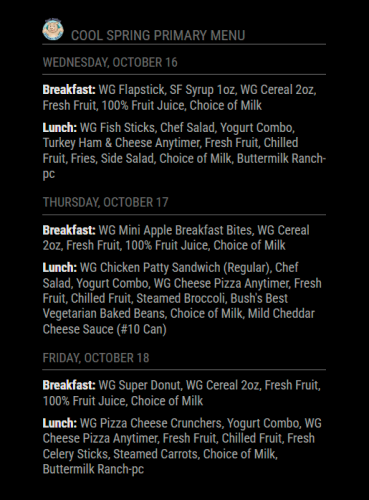

# MMM-MealViewer

A MagicMirror module for displaying school breakfast and lunch menus from MealViewer. You can check to see if your school uses MealViewer [here](https://schools.mealviewer.com/).

- [Screenshot](#screenshot)
- [Installation](#installation)
- [Configuration](#configuration)
    - [Required Configuration](#required-configuration)
    - [Optional Configuration](#optional-configuration)
    - [Filters](#filters)
    - [Configuration for Multiple School Menus](#configuration-for-multiple-school-menus)


## Screenshot



## Installation

1\. Navigate to your MagicMirror's `modules` directory:

`cd ~/MagicMirror/modules/`

2\. Clone this repository:

`git clone https://github.com/dadAndEl/MMM-MealViewer.git`

3\. Install dependencies:

`cd MMM-MealViewer`

`npm install`

## Configuration

Add the following to your `config.js` file:

```javascript
{
    module: "MMM-MealViewer",
    position: "top_left",
    config: {
        schoolId: "YourSchoolId",
        updateInterval: 14400000, // 4 hours, adjust as needed
        startDay: 1, // 0 = Sunday, 1 = Monday, ..., 6 = Saturday
        endDay: 5, // 0 = Sunday, 1 = Monday, ..., 6 = Saturday
        showPastDays: false, // Set to true to show previous days menus
        hideTodayAfter: "14:00", // Specify the time after which to stop showing today's menu
        showBreakfast: true,  // Set to false to not show breakfast menus
        showLunch: true, // Set to false to not show lunch menus
        filters: {
            breakfast: [],
            lunch: []
        },
        itemTypeFilters: {
            breakfast: [],
            lunch: []
        },
        exactNameFilters: {
            breakfast: [],
            lunch: []
        },
        startsWithFilters: {
            breakfast: [],
            lunch: []
        }
    }
}
```

## Required Configuration

`schoolId`

- To find your school ID go to [MealViewer](https://schools.mealviewer.com/), search for your school and click on it.

- The url will look like `https://schools.mealviewer.com/school/YourSchoolID`

- Copy `YourSchoolID` and paste it into the config.js

*Example*
```javascript
 module: "MMM-MealViewer",
 position: "top_right",
 config: {
     schoolId: "MLKElementary",
```

## Optional Configuration

1\. `updateInterval`

How often to fetch new data, in milliseconds. The default is 4 hours, adjust this as you like. 

*Example*
```javascript
     updateInterval: 3600000, // 1 hour
```   

2\. `startDay` and `endDay`

- Define the range of days to display in the menu.
- Values: 0 (Sunday) to 6 (Saturday)
- Default: startDay = 1 (Monday), endDay = 5 (Friday)

*Example*
```javascript
startDay: 0, // Start from Sunday
endDay: 6,   // End on Saturday
```

3\. `showPastDays`

- Whether to show menus for days that have already passed.
- Default: false

*Example*
```javascript
showPastDays: true, // Show past days' menus
```

4\. `hideTodayAfter`

- Time after which to hide today's menu.
- Format: 24-hour time as a string, or "never" to always show today's menu.
- Default: "14:00"

*Example*
```javascript
hideTodayAfter: "never", // Show today's menu until the end of the day
```

5\. `showBreakfast` and `showLunch`

- Whether to display breakfast and lunch menus.
- Default: true for both

*Example*
```javascript
showBreakfast: false, // Don't show breakfast menu
showLunch: true,      // Show lunch menu
```

## Filters

This module offers four types of filters to remove menu items you don't want to display. Each filter type can be applied separately to breakfast and/or lunch menus. For help with filtering items or categories, uncomment lines 36 and 38 in `node_helper.js`, this will write `parsedMealData.json` and `rawMealData.json` files to your `MMM-MealViewer` folder when you run the module. You can then search the data in these files to find `item_Type`, `item_name`, etc that you want to remove.

1\. `filters`

- Partial Match Filters
- Excludes items if any part of the item name includes the specified string.
- Case-insensitive.

*Example:*
```javascript
     filters: {
         breakfast: ["Cereal"],
         lunch: []
     },
```
Would exclude "Cheerios Cereal", "Cereal Bar", "Rice Cereal", etc.

2\. `itemTypeFilters`

- Excludes items based on their type category.
- Exact match, case-sensitive.

*Example:*
```javascript
     itemTypeFilters: {
         breakfast: ["Milk"],
         lunch: ["Milk"]
     },
```

Would exclude all items categorized as "Milk".


3\. `exactNameFilters`

- Excludes items only if the entire item name matches the specified string exactly.
- Case-sensitive.

*Example:*
```javascript
     exactNameFilters: {
         breakfast: [],
         lunch: ["Ketchup Packet"]
     },
```

Would only exclude an item named exactly "Ketchup Packet", but not "Ketchup Packets" or "Packet of Ketchup".

4\. `startsWithFilters`

- Excludes items if the item name starts with the specified string.
- Case-insensitive.

*Example:*
```javascript
     startsWithFilters: {
         breakfast: [],
         lunch: ["Garden Bar"]
     }
```
Would exclude "Garden Bar Tomatoes", "Garden Bar Lettuce", etc.

## Configuration for Multiple School Menus

To display menus for multiple schools on your MagicMirror, you can add multiple instances of the MMM-MealViewer module to your config file.

Here's an example configuration for displaying menus from two different schools:

```javascript
{
    module: "MMM-MealViewer",
    position: "top_left",
    config: {
        schoolId: "YourSchoolId1",
        updateInterval: 14400000, // 4 hours, adjust as needed
        startDay: 1, // 0 = Sunday, 1 = Monday, ..., 6 = Saturday
        endDay: 5, // 0 = Sunday, 1 = Monday, ..., 6 = Saturday
        showPastDays: false, // Set to true to show previous days menus
        hideTodayAfter: "14:00", // Specify the time after which to stop showing today's menu
        showBreakfast: true,  // Set to false to not show breakfast menus
        showLunch: true, // Set to false to not show lunch menus
        filters: {
            breakfast: [],
            lunch: []
        },
        itemTypeFilters: {
            breakfast: [],
            lunch: []
        },
        exactNameFilters: {
            breakfast: [],
            lunch: []
        },
        startsWithFilters: {
            breakfast: [],
            lunch: []
        }
    }
},
{
    module: "MMM-MealViewer",
    position: "top_left",
    config: {
        schoolId: "YourSchoolId2",
        updateInterval: 14400000, // 4 hours, adjust as needed
        startDay: 1, // 0 = Sunday, 1 = Monday, ..., 6 = Saturday
        endDay: 5, // 0 = Sunday, 1 = Monday, ..., 6 = Saturday
        showPastDays: false, // Set to true to show previous days menus
        hideTodayAfter: "14:00", // Specify the time after which to stop showing today's menu
        showBreakfast: true,  // Set to false to not show breakfast menus
        showLunch: true, // Set to false to not show lunch menus
        filters: {
            breakfast: [],
            lunch: []
        },
        itemTypeFilters: {
            breakfast: [],
            lunch: []
        },
        exactNameFilters: {
            breakfast: [],
            lunch: []
        },
        startsWithFilters: {
            breakfast: [],
            lunch: []
        }
    }
}
```

Remember to add a unique `schoolId` to each instance by following the instructions [here](#required-configuration).